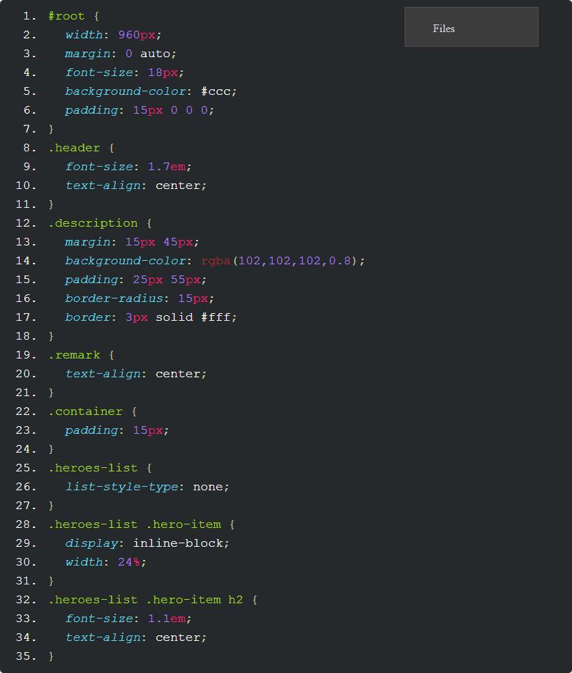
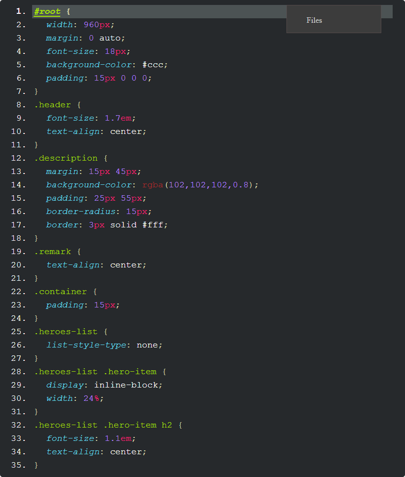
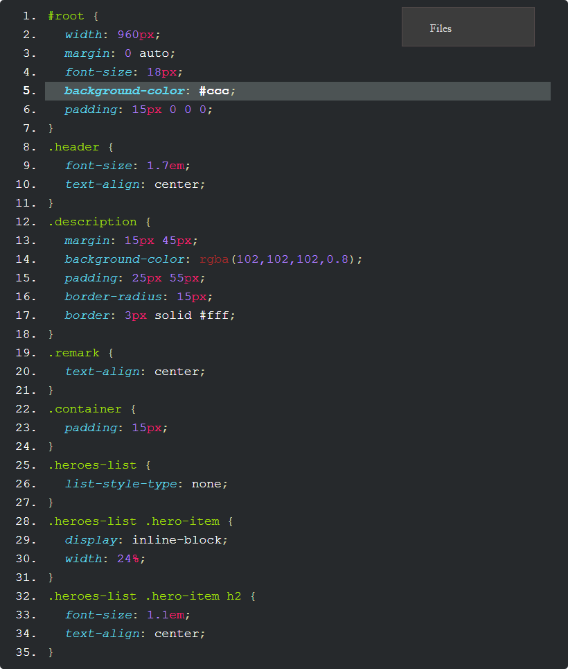
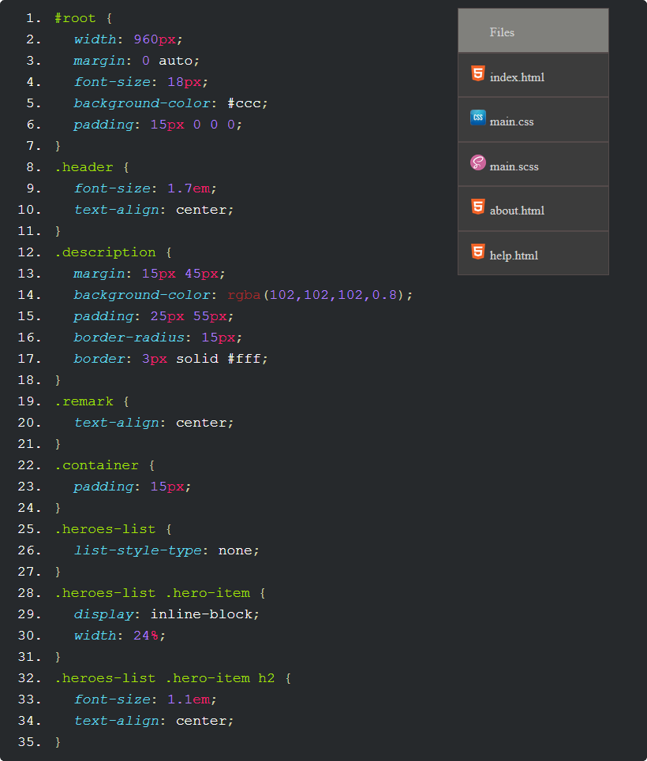
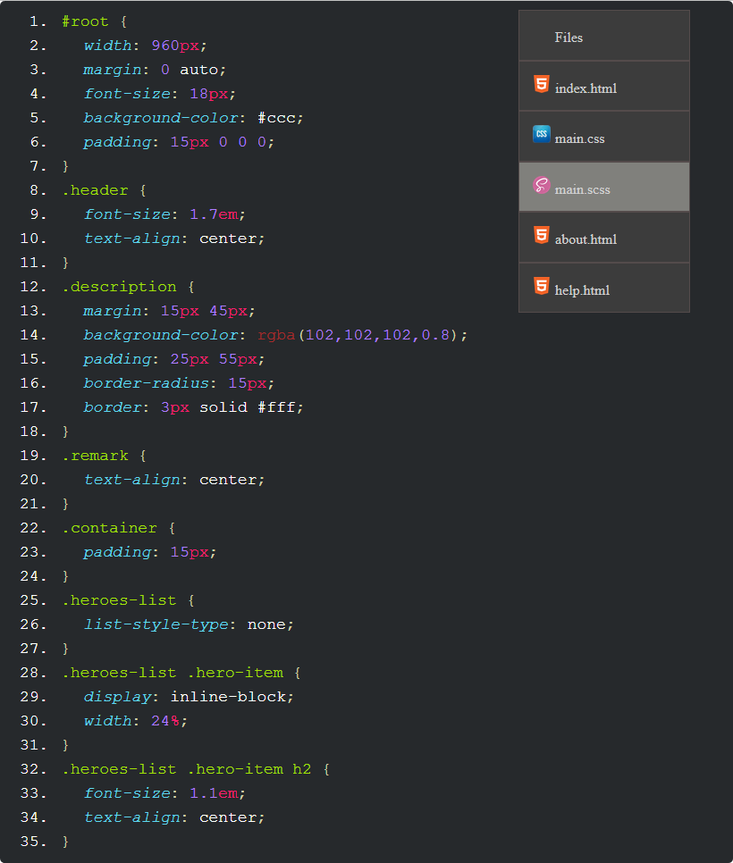

# Task 2 - Text Editor

## Description - read carefully!
- Style the web page in `index.html` so that it looks exactly like the web page from [the example pictures](./result). 
- **Images**: You can use the images in `imgs` folder when styling the web page.

## Requirements
- You should modify `task-2.css` **only**!
- **DO NOT** modify the contents of `index.html`!
- Send a **.zip** file with **both .css** files from both tasks.
- The solution is not required to be pixel perfect. Your solution is required to maintain the ratios from the sample images. Font sizes and sizes will not affect your score, as long as your solution looks like the provided images.

## Pictures
- Initial:

- A selector is hovered:

- A line is hovered:

- The file explorer is hovered:

- A file item from the file explorer is hovered:

