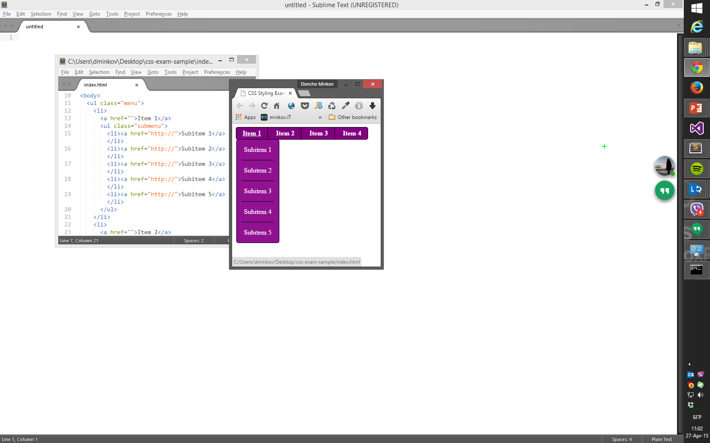
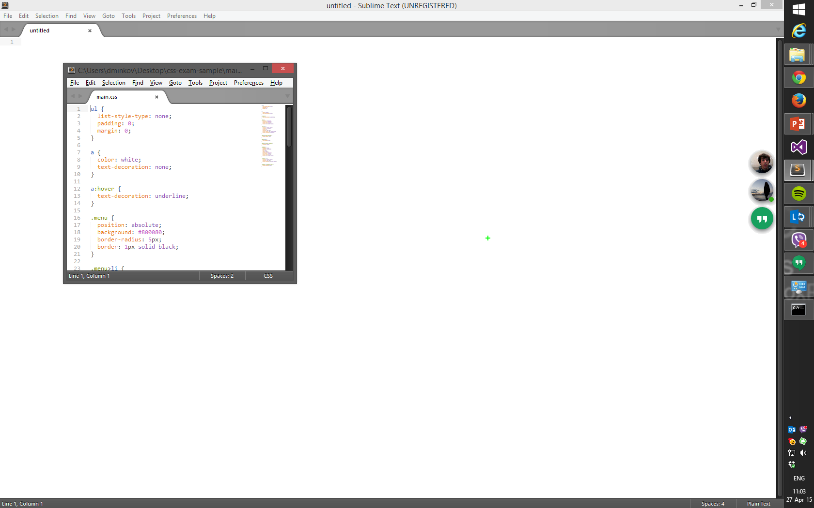

<!-- section start -->
<!-- attr: { class:'slide-title', showInPresentation: true, hasScriptWrapper: true, style:'font-size: 0.9em' } -->
# CSS Styling Introduction
## About the Course

<!--  -->
<!--  -->

	
CSS Styling

	
Telerik Academy

	<a href="https://telerikacademy.com" class="signature-link">telerikacademy.com</a>

<!-- section start -->
<!-- attr: { showInPresentation: true, hasScriptWrapper: true, style:'font-size: 0.9em' } -->
# Table of Contents
- [Course Objectives & Program](#/curriculum)
- [Evaluation](#/evaluation)
- [Required Software](#/software)

<!--  -->
<!--  -->

<!-- section start -->
<!-- attr: { id:'curriculum', class:'slide-section', showInPresentation: true, hasScriptWrapper: true, style:'font-size: 0.9em' } -->
# Course Curriculum
<!--  -->

<!-- attr: { showInPresentation: true, hasScriptWrapper: true, style:'font-size: 0.9em' } -->
<!-- # CSS Styling – Course Topics -->
- CSS Overview
- CSS Presentation
- CSS Layout
- Preprocessors (for CSS)
- **CSS Exam**

<!-- section start -->
<!-- attr: { id:'evaluation', class:'slide-section', showInPresentation: true, hasScriptWrapper: true, style:'font-size: 0.9em' } -->
# Evaluation
<!-- ## Thank God There Are Bonuses! -->
<!--  -->

<!-- attr: { showInPresentation: true, hasScriptWrapper: true, style:'font-size: 0.9em' } -->
<!-- # CSS Styling - Evaluation -->
- Evaluation components
  - **Practical exam** up to **75%**
  - **Attendance** up to **5%**
  - **Homework** up to **10%**
  - Homework **evaluation** up to **5%**
    - 3 peer reviews per homework
  - Helping others up to **5%**

<!--  -->

<!-- attr: { showInPresentation: true, style:'font-size: 0.9em' } -->
# Homework Peer Reviews
- Everyone will **get feedback** for their homework
- Everyone will **give feedback** for few random homework submissions
  - Students submit homework **anonymously**
    - Please exclude your name from the submissions!
  - For each homework submitted
    - Students **evaluate 3 random homeworks**
    - From the same topic, after the deadline
    - Give written feedback, at least 200 characters
    - Low-quality feedback &rarr; report for punishment

<!-- attr: { showInPresentation: true, hasScriptWrapper: true, style:'font-size: 0.9em' } -->
# CSS Styling Exam
- You are given HTML, JavaScript and images:
  - Your task is to achieve the looks with CSS

<!--  -->
<!--  -->

<!-- attr: { showInPresentation: true, style:'font-size: 0.9em' } -->
# Course Web Site & Forums
- Register for the "Telerik Academy Forums":
  - https://telerikacademy.com/Forum/Category/27/HTML-CSS
  - Discuss the course exercises with your colleagues
  - Find solutions for the exercises
  - Share source code / discuss ideas
- The CSS Styling course official web site:
  - http://academy.telerik.com/student-courses/web-design-and-ui/css-styling

<!-- attr: { showInPresentation: true, hasScriptWrapper: true, style:'font-size: 0.9em' } -->
<!-- # Telerik Integrated Learning System -->
- The Telerik Integrated Learning System (TILS)
  - https://www.telerikacademy.com
  - Important resource for all students
  - Homework submissions
  - Homework peer reviews
  - Presence cards with barcode
  - Reports about your results

<!--  -->

<!-- section start -->
<!-- attr: { id:'software', class:'slide-section', showInPresentation: true, hasScriptWrapper: true, style:'font-size: 0.9em' } -->
<!-- # Required Software
 -->

<!-- attr: { showInPresentation: true, style:'font-size: 0.9em' } -->
# Required Software
- Software needed for this course(one of the following):
  - [Sublime Text 2/3](https://www.sublimetext.com/)
  - [NotePad++](https://notepad-plus-plus.org/download/v6.9.1.html)
  - [Jetbrains WebStorm](https://www.jetbrains.com/webstorm/)
  - [Atom](https://atom.io/)
  - [VS Code](https://www.visualstudio.com/en-us/products/code-vs.aspx)
  - [Microsoft Visual Studio](https://www.visualstudio.com/)
- Other useful tools
  - Browser extensions like **ColorZilla**, **Perfect Pixel**, etc

<!-- attr: { class:'slide-section', showInPresentation: true, style:'font-size: 0.9em' } -->
<!-- # CSS Styling: Course Introduction
## Questions? -->

<!-- attr: { showInPresentation: true, hasScriptWrapper: true, style:'font-size: 0.9em' } -->
# Free Trainings @ Telerik Academy
- "Web Design with HTML 5, CSS 3 and JavaScript" course @ Telerik Academy
    - [html5course.telerik.com](html5course.telerik.com)
  - Telerik Software Academy
    - [academy.telerik.com](academy.telerik.com)
  - Telerik Academy @ Facebook
    - [facebook.com/TelerikAcademy](facebook.com/TelerikAcademy)
  - Telerik Software Academy Forums
    - forums.academy.telerik.com

<!--  -->
<!--  -->
<!--  -->
