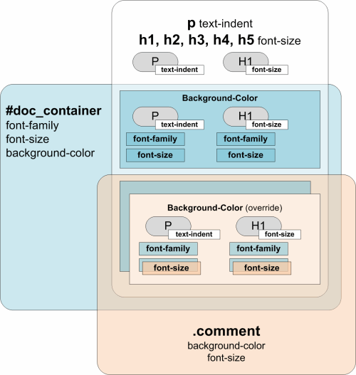
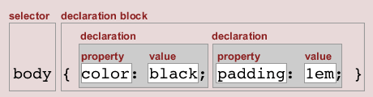
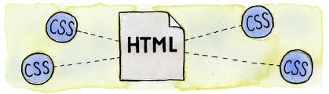
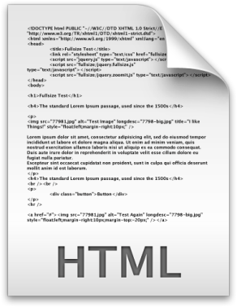
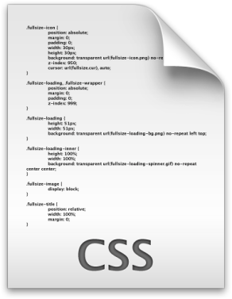
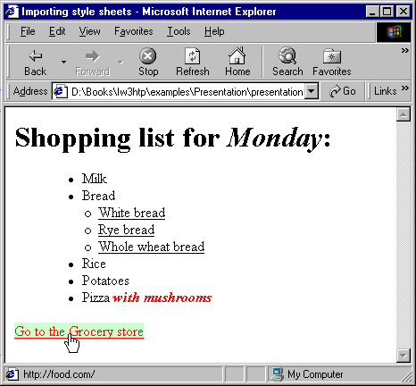
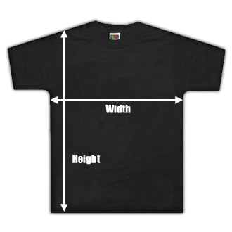
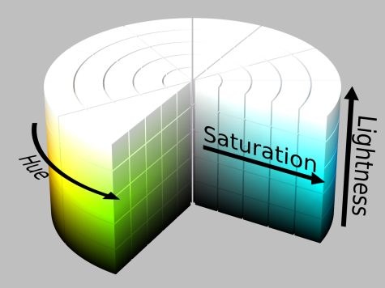

<!-- section start -->
<!-- attr: { class:'slide-title', showInPresentation: true, hasScriptWrapper: true } -->
# CSS Overview
## Cascading Style Sheets

<!--  -->
<!--  -->
<!--  -->

<div class="signature">
	<p class="signature-course">CSS Styling</p>
	<p class="signature-initiative">Telerik Academy</p>
	<a href="https://telerikacademy.com" class="signature-link">telerikacademy.com</a>
</div>

<!-- section start -->
<!-- attr: { showInPresentation: true, hasScriptWrapper: true } -->
# Table of Contents
- [What is CSS?](#/css)
- [Styling with Cascading Style Sheets (CSS)](#/styling-with-css)
- [CSS Selectors](#/common-selectors)
  - [Select by element name, id or class](#/primary-selectors)
  - [Nested Selectors](#/nested-selectors)
- [Importing CSS into HTML](#/importing-css)
- [Attribute selectors](#/attribute-selectors)
- [Pseudo Selectors](#/pseudo-selectors)
- [CSS Values](#/css-values)

<!--  -->


<!-- section start -->
<!-- attr: { id:'css', class:'slide-section', showInPresentation: true, hasScriptWrapper: true } -->
# <a id="css"></a>Cascading Style Sheets
## Separating Content from Presentation

<!--  -->
<!--  -->


<!-- attr: { showInPresentation: true, hasScriptWrapper:true, style:'font-size: 40px;' } -->
# CSS: A New Philosophy
- Separate content from presentation!


<!-- attr: { showInPresentation: true, hasScriptWrapper:true, style:'font-size: 40px;' } -->
# The Resulting Page


<!-- section start -->
<!-- attr: { id:'styling-with-css', class:'slide-section', showInPresentation: true, hasScriptWrapper: true } -->
<!-- # <a id="styling-with-css"></a>CSS Intro -->
## Styling with Cascading Stylesheets


<!--  -->
<!--  -->


<!-- attr: { showInPresentation: true, hasScriptWrapper:true } -->
# CSS Introduction
- Cascading Style Sheets (CSS)
  - Used to **describe** the presentation of documents
  - Define **sizes**, **spacing**, **fonts**, **colors**, **layout**, etc.
  - Improve content **accessibility**
  - Improve **flexibility**
- Designed to separate presentation from content
- Due to CSS, all **HTML presentation** tags and **attributes** are **deprecated**, e.g. **font**, **center**, etc.


<!-- attr: { showInPresentation: true } -->
<!-- # CSS Introduction -->
- CSS can be applied to any XML document
  - Not just to HTML / XHTML
- CSS can specify different styles for different **media**
  - On-screen
  - In print
  - Handheld, projection, etc.
  - … even by voice or Braille-based reader


<!-- attr: { showInPresentation: true } -->
# Why “Cascading”?
- Priority scheme determining which style rules apply to element
  - **Cascade priorities** or **specificity (weight)** are calculated and assigned to the rules
  - Child elements in the HTML DOM tree inherit styles from their parent
    - Can override them
    - Control via **!important** rule


<!-- attr: { showInPresentation: true, hasScriptWrapper: true } -->
<!-- # Why "Cascading"? -->



<!-- attr: { showInPresentation: true, hasScriptWrapper: true } -->
# Style Inheritance
- Some CSS styles are inherited and some are not
  - **Text-related** and **list-related** properties are **inherited**: color, font-size, font-family, line-height, text-align, list-style, etc.
  - **Box-related** and **positioning** styles are **not inherited**: width, height, border, margin, padding, position, float, etc
  - <code>&lt;a></code> elements do not inherit color and text-decoration


<!-- attr: { showInPresentation: true, hasScriptWrapper: true } -->
# Style Sheets Syntax
- Stylesheets consist of **rules**, **selectors**, **declarations**, **properties** and **values**
- **Selectors** are separated by commas
- **Declarations** are separated by semicolons
- **Properties** and **values** are separated by colons

```css
h1,h2,h3 { color: green; font-weight: bold; }
```




<!-- section start -->
<!-- attr: { id:'common-selectors', class:'slide-section', showInPresentation: true, hasScriptWrapper: true } -->
<!-- # <a id="common-selectors"></a>Common Selectors
## Select the Elements to Apply a Style -->

<!--  -->


<!-- attr: { showInPresentation: true } -->
# Selectors
- Selectors determine which element the rules apply to:
  - All elements of specific type (`tag`)
  - Those that match a specific attribute (`id`, `class`)
  - Elements may be matched depending on how they are nested in the document tree (HTML)
- _Examples_:

```css
.header a { color: green }
```


```css
#menu>li { padding-top: 8px }
```


<!-- attr: { id:'primary-selectors', showInPresentation: true, hasScriptWrapper:true, style:'font-size: 0.9em;' } -->
# <a id="primary-selectors"></a>Primary Selectors
- Three primary kinds of selectors:
- By tag (type selector):

```css
h1 { font-family: verdana,sans-serif; }
```
  - By element id:

```css
#element_id { color: #ff0000; }
```
<!-- attr: { showInPresentation: true, hasScriptWrapper:'False', style:'font-size: 0.9em;' } -->
<!-- # Primary Selectors -->
  - By element class name (only for HTML):

```css
.myClass {border: 1px solid red}
```
- Selectors can be combined with commas:

```css
h1, .link, #top-link {font-weight: bold}
```

- 	This will match <code>&lt;h1&gt;</code> **tags**, elements with **class** **link**, and the element with **id** **top-link**


<!-- attr: { id:'nested-selectors', showInPresentation: true, hasScriptWrapper:true, style:'font-size: 0.9em' } -->
# <a id="nested-selectors"></a>Nested Selectors
- Match relative to element placement:

```css
p a {text-decoration: underline}
```

- This will match all <code>&lt;a&gt;</code> tags that are inside of <code>&lt;p&gt;</code>
- __*__ – universal selector (avoid or use with care!):

```css
p * {color: black}
```

<!-- attr: { showInPresentation: true, hasScriptWrapper:'False', style:'font-size: 0.9em' } -->
# Nested Selectors
- This will match all descendants of <code>&lt;p&gt;</code> element
- `+` selector – used to match “next sibling”:

```css
img + .link {float:right}
```

- 	This will match all siblings with class name **link** that appear immediately after <code>&lt;img&gt;</code> tag

<!-- attr: { showInPresentation: true, hasScriptWrapper:true, style:'font-size: 40px' } -->
<!-- # Nested Selectors -->
- <code>&gt;</code> selector – matches direct child nodes:

```css
p > .error {font-size: 8px}
```
- 	This will match all elements with class **error**, direct children of <code>&lt;p&gt;</code> tag

- `.class1.class2` (no space!)

```css
p.post-text.special {font-weight: bold}
```

  - Matches elements with both (all) classes applied at the same time

<!-- attr: { class:'slide-section demo', showInPresentation: true, hasScriptWrapper: true } -->
<!-- # Common Selectors
## [Demo]()
 -->


<!-- section start -->
<!-- attr: { id:'importing-css', class:'slide-section', showInPresentation: true, hasScriptWrapper: true } -->
<!-- # <a id="importing-css"></a>Importing CSS Into HTML
## How to Use CSS with HTML? -->

<!--  -->
<!--  -->


<!-- attr: { showInPresentation: true, hasScriptWrapper:true } -->
# Importing CSS Into HTML
- **CSS** (presentation) can be imported in **HTML** (content) in three ways:
  - **Inline**: the CSS rules in the **style** attribute
    - No selectors are needed
  - **Embedded**: in the **&lt;head&gt;** in a **&lt;style&gt;** tag
  - **External**: CSS rules in separate file (best)
    - Usually a file with **.css** extension
    - Linked via **&lt;link** **rel="stylesheet"** **href="…"&gt;** tag
    - Via **@import** directive in embedded CSS block


<!-- attr: { showInPresentation: true, hasScriptWrapper: true } -->
<!-- # Linking HTML and CSS -->
- Using **external CSS files** is highly recommended
  - Simplifies the HTML document
  - Improves page load speed (CSS file is cached)

<!--  -->
<!--  -->


<!-- attr: { showInPresentation: true, hasScriptWrapper:true } -->
# Inline Styles: _Example_

```html
<!DOCTYPE html>
<html lang="en">
<head>
  <title>Inline Styles</title>
</head>
<body>
  <p>Here is some text</p>

<!-- Separate multiple styles with a semicolon -->

  <p style="font-size: 20pt">Here is some
    more text</p>
  <p style="font-size: 20pt;color:
    #0000FF" >Even more text</p>
</body>
</html>
```


<!-- attr: { showInPresentation: true, hasScriptWrapper: true } -->
<!-- # Inline Styles: _Example_ -->

```html
<!DOCTYPE html>
<html lang="en">
<head>
  <title>Inline Styles</title>
</head>
<body>
  <p>Here is some text</p>

<!-- Separate multiple styles with a semicolon -->

  <p style="font-size: 20pt">Here is some
    more text</p>
  <p style="font-size: 20pt;color:
    #0000FF" >Even more text</p>
</body>
</html>
```


<!-- attr: { showInPresentation: true, hasScriptWrapper:true } -->
# Embedded Styles
- Embedded in the HTML in the **&lt;style&gt;** tag:
  - The **&lt;style&gt;** tag is placed in the **&lt;head&gt;** section of the document
  - **type** attribute specifies the MIME type
    - MIME describes the format of the content
    - Other MIME types include **text/html**, **image/gif**, **text/javascript** …
    - Not required in HTML5
- Used for document-specific styles

```html
<style type="text/css">
```


<!-- attr: { showInPresentation: true, hasScriptWrapper:true } -->
# Embedded Styles: _Example_

```html
<!DOCTYPE html>
<html>
<head>
  <title>Style Sheets</title>
  <style type="text/css">
    em {background-color:#8000FF; color:white}
    h1 {font-family:Arial, sans-serif}
    p  {font-size:18pt}
    .blue {color:blue}
  </style>
<head>
```

<!-- attr: { showInPresentation: true, hasScriptWrapper: true } -->
<!-- # Embedded Styles: _Example_ -->

```html
<body>
  <header>
      <h1 class="blue">A Heading</h1>  
  </header>  
  <article>
      <p>Here is some text. Here is some text.     
        Here is some text. Here is some text. Here
        is some text.
      </p>      
      <h1>Another Heading</h1>        
      <p class="blue">Here is some more text.
         Here is some more text.</p>
      <p class="blue">Here is some <em>more</em>
         text. Here is some more text.
     </p>  
  </article>
</body>
</html>
```


<!-- attr: { showInPresentation: true, hasScriptWrapper:true, style:'font-size: 0.9em' } -->
# External CSS Styles
- External linking
  - Separate pages can all use a shared style sheet
  - Only modify a single file to change the styles across your entire Web site (see http://www.csszengarden.com)
- **link** tag (with a **rel** attribute)
  - Specifies a relationship between current document and another document
```html
<link rel="stylesheet" type="text/css"
  href="styles.css">
```
  - **link** elements should be in the `<head>`


<!-- attr: { showInPresentation: true, hasScriptWrapper:true } -->
<!-- # External CSS Styles -->
- **@import**
  - Another way to link external CSS files
  - _Example_:
```css
<style type="text/css">
    @import url("styles.css");  /* same as */
    @import "styles.css";
</style>
```
  - Ancient browsers do not recognize **@import**
  - Use **@import** in an external CSS file to workaround the IE CSS file limit of 31 files


<!-- attr: { showInPresentation: true, hasScriptWrapper:true, style:'font-size: 0.75em' } -->
# External Styles: _Example_

```css
/* CSS Document */
a {
    text-decoration: none
}

a:hover {
    text-decoration: underline;
    color: red;
    background-color: #CCFFCC
}

li em {
    color: red;
    font-weight: bold
}

ul {
    margin-left: 2cm
}

ul ul {
    text-decoration: underline;
    margin-left: .5cm
}
```

<!-- attr: { showInPresentation: true, hasScriptWrapper:true } -->
<!-- # External Styles: _Example_ -->

```html
  <li>Bread
    <ul>
      <li>White bread</li>
      <li>Rye bread</li>
      <li>Whole wheat bread</li>
    </ul>
  </li>
  <li>Rice</li>
  <li>Potatoes</li>
  <li>Pizza <em>with mushrooms</em></li>
</ul>
<a href="http://food.com" title="grocery
  store">Go to the Grocery store</a>
</body>
</html>
```


<!-- attr: { showInPresentation: true, hasScriptWrapper: true } -->
<!-- # External Styles: _Example_ -->

```html
  <li>Bread
    <ul>
      <li>White bread</li>
      <li>Rye bread</li>
      <li>Whole wheat bread</li>
    </ul>
  </li>
  <li>Rice</li>
  <li>Potatoes</li>
  <li>Pizza <em>with mushrooms</em></li>
</ul>
<a href="http://food.com" title="grocery
  store">Go to the Grocery store</a>
</body>
</html>
```




<!-- section start -->
<!-- attr: { id:'attribute-selectors', class:'slide-section', showInPresentation: true, hasScriptWrapper: true } -->
<!-- # <a id="attribute-selectors"></a>Attribute Selectors
## Picking Elements with Certain Attributes -->


<!-- attr: { showInPresentation: true, hasScriptWrapper:true, style:'font-size: 0.85em' } -->
# Attribute Selectors
- **[ ]** selects elements based on attributes
  - Element with a given attributeSelects **&lt;a&gt;** elements with **title**
```css
a[title] {color:black}
```
  - Elements with a concrete attribute value
  - Selects **&lt;input&gt;** elements with **type=text**
```css
input[type=text] { font-family:Consolas}
```
  - Elements whose attribute values contain a word
```css
a[title*=logo] {border: none}
```
  - Selects **&lt;a&gt;** elements whose title attribute value contains **logo**


<!-- attr: { class:'slide-section demo', showInPresentation: true, hasScriptWrapper: true } -->
<!-- # Attribute Selectors -->
## [Demo]()


<!-- section start -->
<!-- attr: { id:'pseudo-selectors', class:'slide-section', showInPresentation: true, hasScriptWrapper: true } -->
<!-- # <a id="pseudo-selectors"></a>Pseudo Selectors
## Relative to Element Content or State -->

<!--  -->


<!-- attr: { showInPresentation: true, hasScriptWrapper:true, style:'font-size: 0.75em' } -->
# Common Pseudo Selectors
- **Pseudo-classes** define state
  - `:hover`, `:visited`, `:active` , `:lang`
- **Pseudo-elements** define element "parts" or are used to generate content
  - `:first-line` , `:before`, `:after`

```css
a:hover {
    color: red;
}

p:first-line {
    text-transform: uppercase;
}

.title:before {
    content: "»";
}

.title:after {
    content: "«";
}
```


<!-- attr: { class:'slide-section demo', showInPresentation: true, hasScriptWrapper: true } -->
<!-- # Common Pseudo Selectors -->
## [Demo]()


<!-- attr: { showInPresentation: true, hasScriptWrapper:true } -->
# Structural Pseudo-classes
- `:root`
  - The root of the document
- `E:nth-child(n)`
  - An `E` element, the n-th child of its parent
- `E:nth-last-child(n)`
  - An `E` element, the n-th child of its parent, counting from the last on
- `E:nth-of-type(n)`
  - An `E` element, the n-th sibling of its type


<!-- attr: { showInPresentation: true, hasScriptWrapper:true } -->
<!-- # Structural Pseudo-classes -->
- `E:nth-last-of-type(n)`
  - An `E` element, the n-th sibling of its type, counting from the last one
- `E:last-child`
  - An `E` element, last child of its parent
- `E:first-of-type`
  - An `E` element, first sibling of its type
- `E:last-of-type`
  - An `E` element, last sibling of its type


<!-- attr: { showInPresentation: true, hasScriptWrapper:true, style:'font-size: 0.9em' } -->
<!-- # Structural Pseudo-classes -->
- `E:only-child`
  - An `E` element, only child of its parent
- `E:only-of-type`
  - An `E` element, only sibling of its type
- `E:empty`
  - An `E` element that has no children (including text nodes)
- More detailed descriptions:
- http://www.w3.org/TR/css3-selectors/#structural-pseudos


<!-- attr: { class:'slide-section demo', showInPresentation: true, hasScriptWrapper: true } -->
# Structural Selectors
## [Demo]()

<!--  -->


<!-- attr: { showInPresentation: true, hasScriptWrapper:true } -->
# The UI Element States Pseudo-Classes
- `E:enabled`
  - A user interface element `E` which is enabled
- `E:disabled`
  - A user interface element `E` which is disabled
- `E:checked`
  - A user interface element `E` which is checked (for instance a radio-button or checkbox)
  - Currently supported only in Opera and IE10 !


<!-- attr: { class:'slide-section demo', showInPresentation: true, hasScriptWrapper: true } -->
# UI Selectors
## [Demo]()

<!--  -->


<!-- attr: { showInPresentation: true, hasScriptWrapper:true } -->
# Other CSS 3 Selectors
- `E:target`
  - An `E` element being the target of the referring URI
- `E:not(s)`
  - An `E` element that does not match simple selector
- `E~F`
  - An `F` element preceded by an `E` element


<!-- attr: { class:'slide-section demo', showInPresentation: true, hasScriptWrapper: true } -->
# Other CSS 3 Selectors
## [Demo]()
<!--  -->


<!-- section start -->
<!-- attr: { id:'css-values', class:'slide-section', showInPresentation: true, hasScriptWrapper: true } -->
# <a id="css-values"></a>CSS Values
<!-- ## Types, Ranges, Units -->

<!--  -->
<!--  -->
<!--  -->


<!-- attr: { showInPresentation: true, hasScriptWrapper:true, style:'font-size: 0.9em' } -->
<!-- # CSS Values -->
- All values in CSS are strings
  - They can represent values that are not strings
  - I.e. `14px` means size 14 pixels
- Colors are set in a red-green-blue format (RGB)
  - Both in hex and decimal

```css
li.nav-item {
  color: #44f1e1
}
```


```css
li.nav-item {
  color: rgb(68, 241, 255)
}
```


<!-- attr: { showInPresentation: true, hasScriptWrapper:true } -->
# Size Values
- When setting a size (width, height, font-size…) the values are given as numbers
  - Multiple formats / metrics may be used
  - Pixels, ems, e.g. `12px` , `1.4em`
  - Points, inches, centimeters, millimeters
    - E.g. `10pt` , `1in`, `1cm`, `1mm`
  - Percentages, e.g. `50%`
    - Of the size of the container/font size
  - Zero can be used with no unit: `border: 0;`


<!-- attr: { class:'slide-section demo', showInPresentation: true, hasScriptWrapper: true } -->
# Size Values
## [Demo]()

<!--  -->
<!--  -->


<!-- attr: { showInPresentation: true, hasScriptWrapper: true } -->
# Color Values
- Colors in CSS can be represented in few ways
  - Using red-green-blue
    - Or red-green-blue-alpha
```css
color: #f1a2ff
color: rgb(241, 162, 255)
color: rgba(241, 162, 255, 0.1)
```
    - **The opacity values are from 0.0 to 1.0**
  - Using hue-saturation-light
    - Or hue-saturation-light-alpha
```css
color: hsl(291, 85%, 89%);
color: hsl(291, 85%, 89%, 0.1);
```


<!-- attr: { showInPresentation: true, hasScriptWrapper: true } -->
# RGB Colors
- RGB colors are defined with values for red, green and blue intensity
- Syntax:
  - `#44fa36` – values are in hex
  - **rgb**(&lt;red&gt;, &lt;green&gt;, &lt;blue&gt;) – decimal values
- The range for **r**ed, **g**reen and **b**lue is between integers `0` and `255`

```css
color: #07f2b3
  <!– or -->
color: rgb (7, 242, 179)
```


<!--  -->


<!-- attr: { showInPresentation: true, hasScriptWrapper: true, style:'font-size: 0.9em' } -->
# RGBA Colors
- Standard RGB colors with an opacity value for the color (alpha channel)
- Syntax: **rgba**(&lt;red&gt;, &lt;green&gt;, &lt;blue&gt;, &lt;alpha&gt;)
- The range for **r**ed, **g**reen and **b**lue is between integers `0` and `255`
- The range for the **a**lpha channel is between `0.0` and `1.0`
- _Example_: **rgba(255, 0, 0, 0.5)**

<!-- attr: { showInPresentation: true, hasScriptWrapper: true } -->
# HSL Colors
- Hue is a degree on the color wheel
  - `0` (or `360`) is red, `120` is green, `240` is blue
- Saturation is a percentage value
  - `100%` is the full color
- Lightness is also a percentage
  - `0%` is dark (black)
  - `100%` is light (white)
  - `50%` is the average




<!-- attr: { showInPresentation: true, hasScriptWrapper: true, style:'font-size: 0.9em' } -->
# HSLA Colors
- HSLA allows a fourth value, which sets the Opacity (via the Alpha channel) of the element
- As RGBA is to RGB, HSLA is to HSL
- Supported in IE9+, Firefox 3+, Chrome, Safari, and in Opera 10+
- _Example_:
  - **hsla(0,** **100%,** **50%,** **0.5)**
  - Result:


<!--  -->


<!-- attr: { class:'slide-section demo', showInPresentation: true, hasScriptWrapper: true } -->
# Color Values
## [Demo]()

<!--  -->


<!-- section start -->
<!-- attr: { class:'slide-section', showInPresentation: true, hasScriptWrapper: true } -->
<!-- # Default Browser Styles -->
## Why Things Look Different on Different Browsers?


<!-- attr: { showInPresentation: true, hasScriptWrapper:true, style:'font-size: 0.90em' } -->
<!-- # Default Browser Styles -->
- Browsers have **predefined** CSS styles
  - Used when there is no CSS information or any other style information in the document
- **Caution**: default styles differ in browsers
  - E.g. **margins**, **paddings** and **font sizes** differ most often
  - Usually developers reset them

```css
* {
    margin: 0;
    padding: 0;
}
```


```css
body, h1, p, ul, li {
    margin: 0;
    padding: 0;
}
```


<!-- attr: { showInPresentation: true, hasScriptWrapper:true } -->
<!-- # CSS Cascade (Precedence) -->
- There are browser, user and author stylesheets with "`normal`" and "`important`" declarations
  - Browser styles (least priority)
  - Normal user styles
  - Normal author styles (external, in head, inline)
  - Important author styles
  - Important user styles (max priority)

```css
a {
    color: red !important;
}
```


<!-- attr: { showInPresentation: true, hasScriptWrapper:true, style:'font-size: 0.9em' } -->
# CSS Specificity
- CSS specificity is used to determine the precedence (priority) of the CSS style declarations with the same origin
  - Simple calculation:
```css
#id = 100, .class = 10, :pseudo = 10, [attr] = 10, tag = 1, * = 0
```
  - Same number of points? Order matters!
  - See also:
    - [CSS Specificity: Things You Should Know](http://www.smashingmagazine.com/2007/07/27/css-specificity-things-you-should-know/)
    - [CSS Selectors](http://css.maxdesign.com.au/selectutorial/advanced_conflict.htm)


<!-- attr: { class:'slide-section demo', showInPresentation: true, hasScriptWrapper: true } -->
# CSS Rules Precedence
## [Demo]()


<!-- attr: { showInPresentation: true, hasScriptWrapper:true } -->
# CSS References
- The CSS documentation at WebPlatform.org:
  - http://docs.webplatform.org/wiki/css
- CSS documentation at MDN
  - https://developer.mozilla.org/en-US/docs/CSS
- CSS3 tutorial
  - http://www.w3schools.com/css3/
- A list of all CSS 2.1 properties is available at http://www.w3.org/TR/CSS2/propidx.html


<!-- section start -->
<!-- attr: { class:'slide-section', showInPresentation:true, hasScriptWrapper:false } -->
<!-- # CSS Overview
## Questions? -->


<!-- attr: { showInPresentation: true, hasScriptWrapper: true } -->
# Free Trainings @ Telerik Academy
- Web front-end track
    - [html.telerik.com](http://academy.telerik.com/student-courses/web-design-and-ui/about)
  - Telerik Software Academy
    - [academy.telerik.com](academy.telerik.com)
  - Telerik Academy @ Facebook
    - [facebook.com/TelerikAcademy](facebook.com/TelerikAcademy)
  - Telerik Academy Learning System
    - [telerikacademy.com](https://telerikacademy.com)
