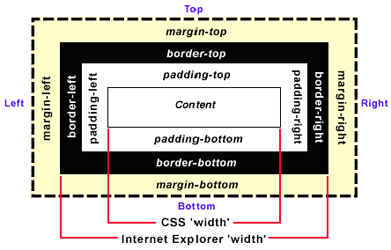
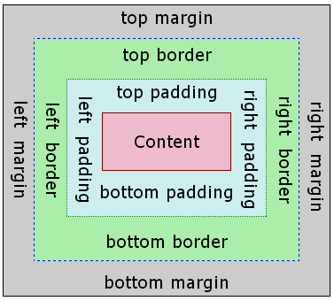
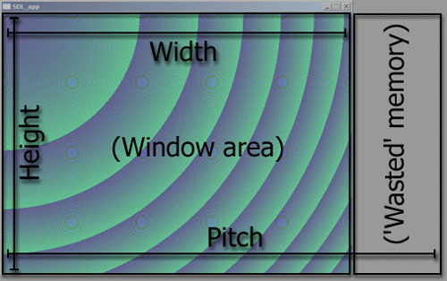
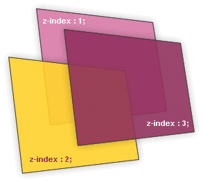
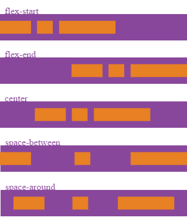

<!-- section start -->
<!-- attr: { class:'slide-title', showInPresentation:true, hasScriptWrapper:true } -->
# CSS Layout
## Control the arrangement of the HTML elements
<!--   -->

<!--   -->
<div class="signature">
	<p class="signature-course">CSS Styling</p>
	<p class="signature-initiative">Telerik Software Academy</p>
	<a href="https://telerikacademy.com" class="signature-link">https://telerikacademy.com</a>
</div>

<!-- section start -->
<!-- attr: { showInPresentation:true, hasScriptWrapper:true } -->
# Table of Contents
- [Width and Height](#width)
- [Overflow](#overflows)
- [Display](#displays)
- [Visibility](#visible)
- [Margins and Paddings](#margins)
- [CSS Box Model](#boxmodel)
- [Position](#positioning)
- [Float](#floating)
- [Flexbox](#flex)

<!--   -->
<!--   -->


<!-- section start -->
<!-- attr: { class:'slide-section', showInPresentation:true, hasScriptWrapper:true } -->
<!-- # Width/Height -->
<!--   -->
<!--   -->


<!-- attr: { id:'width', showInPresentation:true, hasScriptWrapper:true } -->
# Width
- **width** – defines numerical value for the width of element, e.g. **200px**
- **width** applies only for block elements
  - Their with is 100% by default
  - The width of inline elements is always the width of their content, by concept
- **min-width** - defines the minimal width
  - **min-width** overrides width if (**width<min-width**)
- **max-width** - defines the maximal width
  - **max-width** overrides width if (**width>max-width**)


<!-- attr: { class:'slide-section demo', showInPresentation:true, hasScriptWrapper:true } -->
<!-- # Width
## [Demo]() -->
<!--   -->


<!-- attr: { showInPresentation:true, hasScriptWrapper:true } -->
# Height
- **height** – defines numerical value for the height of element, e.g. **100px**
- **height** applies only on block elements
  - The **height** of inline elements is always the height of their content
- **min-height** - defines the minimal height
  - **min-height** overrides height
- **max-height** - defines the maximal height
  - **max-height** overrides height


<!-- attr: { showInPresentation:true, hasScriptWrapper:true } -->
# Width and Height Values
- The values of the **width** and **height** properties are numerical:
  - Pixels (px)
  - Centimeters (cm)
  - Or percentages
    - A percent of the available width


<!-- attr: { class:'slide-section demo', showInPresentation:true, hasScriptWrapper:true } -->
<!-- # Height
## [Demo]() -->
<!--   -->


<!-- section start -->
<!-- attr: { class:'slide-section', showInPresentation:true, hasScriptWrapper:true } -->
<!-- # Overflow -->
<!--   -->
<!--   -->


<!-- attr: { id:'overflows', showInPresentation:true, hasScriptWrapper:true } -->
# Overflow
- **overflow** defines the behavior of element when content needs more space than the available
- **overflow** values:
  - **visible** (default) – content spills out of the element
  - **auto** – show scrollbars if needed
  - **scroll** – always show scrollbars
  - **hidden** – any content that cannot fit is clipped


<!-- attr: { class:'slide-section demo', showInPresentation:true, hasScriptWrapper:true } -->
<!-- # Overflow
## [Demo]() -->
<!--   -->
<!--   -->


<!-- section start -->
<!-- attr: { class:'slide-section', showInPresentation:true, hasScriptWrapper:true } -->
<!-- # Display -->
<!--   -->


<!-- attr: { id:'displays', showInPresentation:true, hasScriptWrapper:true } -->
# Display
- **display** controls the display of the element and the way it is rendered and if breaks should be placed before and after the element
- **display** values:
  - **inline**: no breaks are placed before or after (**<span>** is an inline element)
    - **height** and **width** depend on the content
  - **block**:  breaks are placed before AND after the element (**<div>** is a block element)
    - **height** and **width** may not depend on the size of the content


<!-- attr: { showInPresentation:true, hasScriptWrapper:true } -->
# Display Values
- **display** values:
  - **none**: element is hidden and its dimensions are not used to calculate the surrounding elements rendering
    - differs from **visibility:** **hidden**!
  - **inline-block**: no breaks are placed before and after (like **inline**)
    - **height** and **width** can be applied (like **block**)
  - **table**, **table-row**, **table-cell**: the elements are arranged in a table-like layout


<!-- attr: { class:'slide-section demo', showInPresentation:true, hasScriptWrapper:true } -->
<!-- # Display
## [Demo]() -->
<!--   -->


<!-- section start -->
<!-- attr: { class:'slide-section', showInPresentation:true, hasScriptWrapper:true } -->
<!-- # Visibility -->
<!--   -->


<!-- attr: { id:'visible', showInPresentation:true, hasScriptWrapper:true } -->
# Visibility
- **visibility**
  - Determines whether the element is visible
  - **hidden**: element is not rendered, but still occupies place on the page
    - similar to **opacity:0**
  - **visible**: element is rendered normally
  - **collapse**: collapse removes a row or column, but it does not affect the table layout
    - only for table elements
    - The space taken up by the row or column will be available for other content


<!-- attr: { class:'slide-section demo', showInPresentation:true, hasScriptWrapper:true } -->
<!-- # Visibility
## [Demo]() -->
<!--   -->


<!-- section start -->
<!-- attr: { class:'slide-section', showInPresentation:true, hasScriptWrapper:true } -->
<!-- # Margins and Paddings -->
<!--   -->


<!-- attr: { id:'margins' showInPresentation:true, hasScriptWrapper:true } -->
# Margin and Padding
- **margin** and **padding** define the spacing around the element
  - Numerical value, e.g. **10px** or **-5px**
  - Can be defined for each of the four sides separately – **margin-top**, **padding-left**, …
  - **margin** is the spacing outside of the border
  - **padding** is the spacing between the border and the content
- Collapsing margins
  - When the vertical margins of two elements are touching, only the margin of the element with the largest margin value will be honored


<!-- attr: { showInPresentation:true, hasScriptWrapper:true } -->
# Margin and Padding: Short Rules
- **margin: 5px**;
  - Sets all four sides to have margin of 5 px;
- **margin: 10px 20px;**
  - top and bottom to 10px, left and right to 20px;
- **margin: 5px 3px 8px;**
  - top 5px, left/right 3px, bottom 8px
- **margin: 1px 3px 5px 7px;**
  - top, right, bottom, left (clockwise from top)
- Same for **padding**


<!-- attr: { class:'slide-section demo', showInPresentation:true, hasScriptWrapper:true } -->
<!-- # Margins and Paddings
## [Demo]() -->
<!--   -->


<!-- section start -->
<!-- attr: { class:'slide-section', showInPresentation:true, hasScriptWrapper:true } -->
<!-- # Box Model -->
<!--   -->


<!-- attr: { id:'box-model', showInPresentation:true, hasScriptWrapper:true } -->
# CSS3 box-sizing
- Determine whether you want an element to render it's borders and padding within its specified width, or outside of it.
- Possible values:
  - **box-sizing: content-box** (default)box width: 288px + 10px padding + 1px border on each side = 300px
  - **box-sizing: border-box** box width: 300px, including padding and borders


<!-- attr: { showInPresentation:true, hasScriptWrapper:true } -->
<!-- # CSS3 box-sizing (_Example_) -->
- _Example_: Box with total width of 300px (including paddings and borders)

```cs
.container{
width: 300px;
border: 1px solid black;
padding: 5px;

/* Firefox */
-moz-box-sizing: border-box;
/* WebKit */
-webkit-box-sizing: border-box;
/* Opera 9.5+, Google Chrome */
box-sizing: border-box;
}
```


<!-- attr: { showInPresentation:true, hasScriptWrapper:true } -->
# IE Quirks Mode
- When using quirks mode<br /> (pages with no DOCTYPE <br /> or with a HTML 4 <br /> Transitional DOCTYPE)
    - Internet Explorer violates<br /> the box model standard!

<!--   -->


<!-- attr: { class:'slide-section demo', showInPresentation:true, hasScriptWrapper:true } -->
<!-- # Box Model
## [Demo]() -->
<!--   -->


<!-- section start -->
<!-- attr: { class:'slide-section', showInPresentation:true, hasScriptWrapper:true } -->
<!-- # Positioning -->
<!--   -->
<!--   -->


<!-- attr: { id:'positioning', showInPresentation:true, hasScriptWrapper:true } -->
# Positioning
- **position**: defines the positioning of the element in the page content flow
-  The value is one of:
  - **static** (default)
  - **relative** – relative position according to where the element would appear with static position
  - **absolute** – relative to the first parent element that has a position other than static
  - **fixed** – relative to the browser window, but ignores page scrolling


<!-- attr: { showInPresentation:true, hasScriptWrapper:true } -->
<!-- # Positioning -->
- Margin VS relative positioning
- Fixed and absolutely positioned elements do not influence the page normal flow and usually stay on top of other elements
  - Their position and size are ignored when calculating the size of parent element or position of surrounding elements
  - Overlaid according to their **z-index**
  - Inline fixed or absolutely positioned elements can apply height like block-level elements


<!-- attr: { showInPresentation:true, hasScriptWrapper:true } -->
<!-- # Positioning -->
- **top**, **left**, **bottom**, **right**: specifies offset of absolute/fixed/relative positioned element as numerical values
- **z-index** : specifies the stack level of positioned elements
  - Understanding stacking context

<!--   -->


<!-- attr: { class:'slide-section demo', showInPresentation:true, hasScriptWrapper:true } -->
<!-- # Positioning
## [Demo]() -->
<!--   -->
<!--   -->


<!-- attr: { showInPresentation:true, hasScriptWrapper:true } -->
# Inline element positioning
- **vertical-align**: sets the vertical-alignment of an inline element, according to the line height
  - Values: **baseline**, **sub**, **super**, **top**, **text-top**, **middle**, **bottom**, **text-bottom** or numeric
  - Also used for content of table cells (which apply **middle** alignment by default)


<!-- attr: { class:'slide-section demo', showInPresentation:true, hasScriptWrapper:true } -->
<!-- # Alignment and Z-Index
## [Demo]() -->
<!--   -->
<!--   -->
<!--   -->


<!-- section start -->
<!-- attr: { class:'slide-section', showInPresentation:true, hasScriptWrapper:true } -->
<!-- # Floating -->
<!--   -->
<!--   -->


<!-- attr: { id:'floating', showInPresentation:true, hasScriptWrapper:true } -->
# Float
- **float**: the element “floats” to one side
  - **left**: places the element on the left and following content on the right
  - **right**: places the element on the right and following content on the left
  - floated elements should come before the content that will wrap around them in the code
  - margins of floated elements do not collapse
  - floated inline elements can apply height


<!-- attr: { showInPresentation:true, hasScriptWrapper:true } -->
<!-- # Float -->
- How floated elements are positioned

<!--   -->


<!-- attr: { showInPresentation:true, hasScriptWrapper:true } -->
# Clear
- **clear**
  - Sets the sides of the element where other floating elements are NOT allowed
  - Used to "drop" elements below floated ones or expand a container, which contains only floated children
  - Values: **left**, **right**, **both**
- Clearing floats
  - Clear using pseudo-class **:after**
  - Additional element (**&lt;div&gt;**) with a clear style
    - Deprecated - semantically unused div
- https://css-tricks.com/all-about-floats/
- IE: positioniseverything.net/easyclearing.html

<!-- section start -->
<!-- attr: { class:'slide-section', showInPresentation:true, hasScriptWrapper:true } -->
<!-- # Flexbox
## The Next Generation of CSS Layout -->
<!--   -->

<!-- attr: { id:'flex', showInPresentation:true, hasScriptWrapper:true } -->
# Flexbox
- **Flexbox Layout**
  - Layout mode for the arrangement of elements on a page
  - The elements behave predictably on different screen sizes and different display devices
- **Browser compatibility**
  - [compatibility table](https://developer.mozilla.org/en-US/docs/Web/CSS/CSS_Flexible_Box_Layout/Using_CSS_flexible_boxes#Browser_compatibility)
- **Complete guide**
  - [guide](https://css-tricks.com/snippets/css/a-guide-to-flexbox/)

  <!-- attr: { showInPresentation:true, hasScriptWrapper:true } -->
# Flexbox vocabulary

- Flex container
- Flex item
- Axes
- Directions
- Lines
- Dimensions

  <!--   -->

  <!-- attr: { showInPresentation:true, hasScriptWrapper:true } -->
  # Parent properties
- **display** - enables flex for all children

```css
.container {
    display: flex; /* or inline-flex */
}
```

- **flex-direction** - establishes the main-axis

```css
.container {
  flex-direction: row | row-reverse | column | column-reverse;
}
```

- **flex-wrap** - flex items will all try to fit onto one line by default

```css
.container {
  flex-wrap: nowrap | wrap | wrap-reverse;
}
```

<!-- attr: { showInPresentation:true, hasScriptWrapper:true } -->
# Parent properties
- **flex-flow** - shorthand for **flex-direction** and **flex-wrap**

```css
.container {
flex-flow: <‘flex-direction’> || <‘flex-wrap’>
}
```

- **justify-content** - defines the alignment along the main axis

```css
.container {
  justify-content: flex-start | flex-end | center | space-between | space-around;
}
```

<!--   -->

<!-- attr: { showInPresentation:true, hasScriptWrapper:true } -->
# Parent properties
- **align-items** - justify-content version for the cross-axis

```css
.container {
  align-items: flex-start | flex-end | center | baseline | stretch;
}
```

- **align-content** - flex container's lines within when there is extra space in the cross-axis

```css
.container {
  align-content: flex-start | flex-end | center | space-between | space-around | stretch;
}
```

<div class="fragment balloon" style="top:20%; left:5%; width:45%;">Align Items
    
</div>
<div class="fragment balloon" style="top:20%; left:55%; width:45%;">Align Content
    
</div>

<!-- attr: { showInPresentation:true, hasScriptWrapper:true } -->
# Children properties
- **order** - controls the order in which the children appear in the flex container

```css
.item {
  order: <integer>;
}
```

- **flex-grow** - defines the ability for a flex item to grow if necessary

```css
.item {
  flex-grow: <number>; /* default 0 */
}
```

<!-- attr: { showInPresentation:true, hasScriptWrapper:true } -->
<!-- # Children properties -->
- **flex-shrink** - defines the ability for a flex item to shrink if necessary

```css
.item {
  flex-shrink: <number>; /* default 1 */
}
```

- **flex-basis** - defines the default size of an element before the remaining space is distributed

```css
.item {
  flex-basis: <length> | auto; /* default auto */
}
```

<!-- attr: { showInPresentation:true, hasScriptWrapper:true } -->
<!-- # Children properties -->
- **flex** - shorthand for **flex-grow**, **flex-shrink** and **flex-basis** combined (**recommended**)

```css
.item {
  flex: none | [ <'flex-grow'> <'flex-shrink'>? || <'flex-basis'> ]
}
```

- **align-self** - allows the default alignment (or the one specified by align-items) to be overridden for individual flex items

```css
.item {
  align-self: auto | flex-start | flex-end | center | baseline | stretch;
}
```

<div class="fragment balloon" style="top:45%; left:55%; width:25%;"><p>Align Self</p>
    
</div>


<!-- attr: { class:'slide-section', showInPresentation:true, hasScriptWrapper:true } -->

# CSS Layout
## Questions?


<!-- attr: { showInPresentation:true, hasScriptWrapper:true } -->
# Free Trainings @ Telerik Academy
- "Web Design with HTML 5, CSS 3 and JavaScript" course @ Telerik Academy
    - [html5course.telerik.com](html5course.telerik.com)
  - Telerik Software Academy
    - [academy.telerik.com](academy.telerik.com)
  - Telerik Academy @ Facebook
    - [facebook.com/TelerikAcademy](facebook.com/TelerikAcademy)
  - Telerik Software Academy Forums
    - forums.academy.telerik.com

<!--   -->
<!--   -->
<!--   -->
<!--   -->
