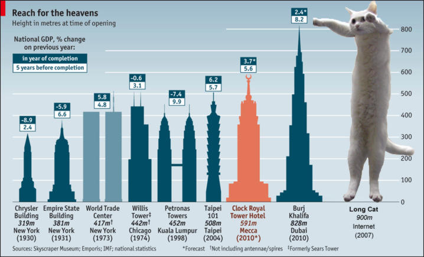

<!-- section start -->
<!-- attr: { class:'slide-title', showInPresentation:true, hasScriptWrapper:true } -->
# LESS
## The Dynamic Stylesheet Language

<div class="signature">
	<p class="signature-course">CSS Styling</p>
	<p class="signature-initiative">Telerik Software Academy</p>
	<a href="telerikacademy" class="signature-link">telerikacademy.com</a>
</div>


<!-- section start -->
<!-- attr: { showInPresentation:true } -->
# Table of Contents
- [LESS Overview](#overview)
- [Working with LESS](#working-with-less)
  - [On the Client](#client)
  - [On the Server](#server)
- [LESS Features](#features)
  - [Selector nesting](#selectors)
  - [Variables and Interpolation](#variables-and-interpolation)
  - [Mixins and Functions](#mixins-and-functions)
  - [Loops](#loops)

<!--  -->


<!-- section start -->
<!-- attr: { id:'overview', class:'slide-section', showInPresentation:true } -->
<!-- # <a id="overview"></a>LESS Overview
## What is LESS? -->

<!-- attr: { showInPresentation:true, hasScriptWrapper:true } -->
# LESS Overview
- Extension to CSS - http://lesscss.org/
  - Write "less" code – compile to normal CSS
  - Can be parsed both Client and Server side
    - Using a LESS parser written in JavaScript
- LESS Features include
  - Variables
  - Mixins
  - Color editing functions
  - Selector nesting and more

<!--  -->


<!-- section start -->
<!-- attr: { id:'working-with-less', showInPresentation:true, hasScriptWrapper:true, style:'font-size: 0.8em;' } -->
# <a id="working-with-less"></a>Using LESS on the Client
- LESS can be parsed on the client (browser)
  - Include a JavaScript file, that does the parsing

```html
<link rel="stylesheet/less" type="text/css" href="styles.less"/ >
<sсript src="less.js"></sсript> //after the less link
```

- Steps:
  - Write your LESS
  -  Using Visual Studio, you should add a mime type for the LESS in web.config

```xml
<configuration> <system.webServer> <staticContent>
  <mimeMap fileExtension=".less" mimeType="text/css" />   
</staticContent> </system.webServer> </configuration>
```

  - You are ready to go

<!-- attr: { id:'client', showInPresentation:true, style:'font-size: 0.9em' } -->
<!-- # <a id="client"></a>Using LESS on the Client -->
- How client-side LESS works?
  - The JavaScript performs a AJAX GET request to LESS file
  - Then it parses all the LESS code into pure CSS
  - The CSS is appended to the HEAD of the page
- **Using client-side LESS is slow**
  - All the parsing is done by the client
  - i.e. spend some of the browser resources for pointless parsing - Imagine a 2000-lines-long LESS file…


<!-- attr: { id:'server', showInPresentation:true } -->
# <a id="server"></a>Parsing LESS on the Server
- LESS can be parsed on the server in many ways
  - **Using the client approach** and copy the parsed CSS
    - Not good enough, lots of copy-pastying
  - **Using node.js** to do the parsing
    - Better solution - the parsing is automated
  - **Using plugins**
    - IDEs - VS Web Essentials, Webstorm plugins
    - Text editors - VS Code, Atom, Sublime Text and other also have plugins


<!-- attr: { showInPresentation:true, style:'font-size: 0.8em' } -->
# How To Use Node.js
- Install Node from https://nodejs.org/
- Open Command Prompt and write

```bat
npm install less -g
```

- Navigate to the folder with the .less file
- Write down the following

```bat
$ lessc {less file} {output CSS file}
```

- You can also minify the result

```bat
$ lessc –x {less file} {output CSS file}
```

<!-- section start -->
<!-- attr: { id:'features', class:'slide-section', showInPresentation:true } -->
<!-- # <a id="features"></a>LESS Features
## Selector Nesting, Mixins, Variables, etc… -->


<!-- attr: { id:'selectors', showInPresentation:true, style:'font-size: 0.7em' } -->
# <a id="selectors"></a>Selector Nesting
- LESS introduces selector nesting

```less
body {
    font: normal 16px arial;
    color: #fff;
    background-color: #011b63;
    h1 {
        font-size: 2.3em;
        font-weight: bold;
    }
}
```

- Parses to

```css
body {
    font: normal 16px arial;
    color: #fff;
    background-color: #011b63;
}

body h1 {
    font-size: 2.3em;
    font-weight: bold;
}
```


<!-- attr: { showInPresentation:true, style:'font-size: 0.9em' } -->
<!-- # Selector Nesting -->
- All selectors inside a selector are translated to nested selectors
- Selectors can also reference themselves inside their selector using the symbol **&**

```less
 a {
   color: black;
   &:hover { color: red; }
 }
```

```css
 a { color: black; }
 a:hover { color: red; }
```

<!--  -->


<!-- attr: { id:'variables-and-interpolation', showInPresentation:true, style:'font-size: 0.75em' } -->
# <a id="variables-and-interpolation"></a>LESS Variables
- LESS also has variables
  - Using the @ (at) symbol
  - Can be used to store colors, size, etc…
- Usable to set default background-color, font-color, font-size, etc…

```less
@link-color: #ffffff;
@v-link-color: #646363;
a {
  color: @link-color;
  &:visited {
    color: @v-link-color;
}
```


```css
body a {
    color: white;
}
body a:visited {
    color: #646363;
}
```

<!--  -->


<!-- attr: { showInPresentation:true } -->
# Interpolation
- LESS variables can be inserted as CSS properties
  - Using **@{…}**

```less
@border-side: top;
@border-color: blue;
@border-style: ridge;
@border-width: 15px;

border-@{border-side} :
  @border-width @border-style @border-color;
```

```css
border-top : 15px ridge blue
```

<!--  -->


<!-- attr: { showInPresentation:true, style:'font-size: 0.85em' } -->
# Extend
- The **:extend** pseudo selector can be used to extend a selector
- More here: http://lesscss.org/features/#extend-feature

```less
nav ul {
  &:extend(.inline);
  background: blue;
}
.inline {
  color: red;
}
```

```css
nav ul {
  background: blue;
}
.inline, nav ul {
  color: red;
}
```

<!--  -->


<!-- attr: { id:'mixins-and-functions', showInPresentation:true } -->
# <a id="mixins-and-functions"></a>Functions
- LESS support predefined functions
  - For stuff with colors
  - For sizes (percentages)
  - Find all the functions at http://lesscss.org/functions/

```less
@color: #ffffff;
background-color: lighten(@color, 10%);
color: darken(@color, 15%);
percentage(0.5); //returns 50%
```

<!-- attr: { showInPresentation:true } -->
# Mixins
- Mixins are kind of **developer defined functions**
  - The developer can make them for clear LESS
- Two kind of mixins
  - **Parameterless**
    - Get a default styles every time
  - **With parameters**
    - Get style based on some parameters
    - Gradient, borders, etc…


<!-- attr: { showInPresentation:true, style:'font-size: 0.8em' } -->
<!-- # Mixins -->
- How to define mixins?
  - Use **.mixin-name**
  - Then the styles are normal LESS
  - How to use the mixin?
    - Place use **.mixin-name**

```less
.clearfix {
    zoom: 1;
    &:after {
        display: block;
        content: "";
        height: 0;
        clear: both;
    }
}
```


```css
ul#main-nav{
  .clearfix;
}
```

<!--  -->


<!-- attr: { showInPresentation:true, style:'font-size: 0.85em' } -->
# Mixins with Arguments
- Mixins can also be defined with parameters
  - i.e. for gradient-background
- Use the arguments like a C# method

```less
.opacity(@value){
    ...
}

//arguments can take default values
.box(@border: none, @bg: rgba(0,0,0,0.7), @size: 200px) {
    ...
}

div.box-div {
    .box; //using the mixin with default parameter values
    .opacity(0.5); //using the mixin with 0.5 value
}
```
<!--  -->


<!-- attr: { showInPresentation:true } -->
# Pattern-matching Mixins
- Mixins can define different behavior, depending on its parameters

```less
.color(dark; @color){
  color: @arken(@color, 25%);
}
.color(light; @color){
  color: lighten(@color, 25%);
}
//called no matter which of the above is called
@color(@_; @color){
  border: 1px solid @color;
}
```

<!-- attr: { showInPresentation:true } -->
# Mixin "Return" Values
- Mixins can have **return** values because of the variable scope

```less
.average(@x, @y) {
  @average: ((@x + @y) / 2);
}

div {
  .average(16px, 50px); // "call" the mixin
  padding: @average;    // use its "return" value
}

/* Compiles to */
div {
  padding: 33px;
}
```

<!-- attr: { showInPresentation:true } -->
# Importing Other Files
- You can import other files wherever you want
  - In our main file
  - In our "other-styles.less" file
  - Results in

```less
.foo { background: #900; }
@import "other-styles.less";
```


```less
/* other-styles.less */
.foobar { background: #900; }
```


```less
.foo { background: #900; }
.foobar { background: #900; }
```

<!--  -->


<!-- attr: { showInPresentation:true } -->
# Conditional Mixins
- Also called **Mixin Guards**
  - Using **when** keyword can specify conditions on which the mixin will be called
  - Operators are `>`, `>=`,`=`, `=<`, `<`

```less
.mixin (@a) when (lightness(@a) >= 50%) {
    background-color: white;
}

.mixin (@a) when (lightness(@a) < 50%) {
    background-color: black;
}
```


<!-- attr: { id:'loops', showInPresentation:true } -->
# <a id="loops"></a>Loops
- Because of **Mixin Guards** you can create loop/iterations structure

```less
.loop(@counter) when (@counter > 0) {
    .loop((@counter - 1)); /* next iteration */
    width: (10px * @counter); /* code for each iteration */
}

div {
    .loop(5); /* launch the loop */
}
```

<!--  -->


<!-- attr: { class:'slide-section', showInPresentation:true } -->
<!-- # LESS
## Questions? -->


<!-- attr: { showInPresentation:true, hasScriptWrapper:true, style:'font-size: 0.95em' } -->
# Free Trainings @ Telerik Academy
- "Web Design with HTML 5, CSS 3 and JavaScript" course @ Telerik Academy
    - [css course](http://academy.telerik.com/student-courses/web-design-and-ui/css-styling/about)
  - Telerik Software Academy
    - [telerikacademy.com](https://telerikacademy.com)
  - Telerik Academy @ Facebook
    - [facebook.com/TelerikAcademy](http://facebook.com/TelerikAcademy)
  - Telerik Software Academy Forums
    - [forums.academy.telerik.com](http://forums.academy.telerik.com)

<!--  -->
<!--  -->
<!--  -->
