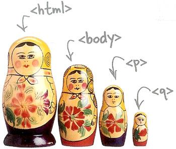
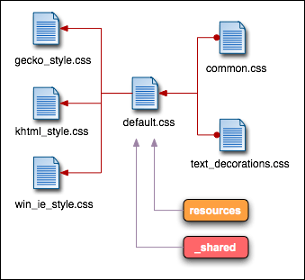

<!-- section start -->
<!-- attr: { class:'slide-title', showInPresentation:true, hasScriptWrapper:true } -->
# SASS
## Syntactically Awesome Stylesheets

<div class="signature">
	<p class="signature-course">CSS Styling</p>
	<p class="signature-initiative">Telerik Software Academy</p>
	<a href="telerikacademy" class="signature-link">telerikacademy.com</a>
</div>

<!--  -->
<!--  -->


<!-- section start -->
<!-- attr: { showInPresentation:true, hasScriptWrapper:true, style:'font-size: 0.75em' } -->
# Table of Contents
- [SASS Overview](#overview)
- [Working with SASS](#working-with-sass)
  - [Using Ruby](#sass-with-ruby)
  - [Using Visual Studio Plugins](#vs-plugin)
- [SASS Features](#features)
  - [Selector Nesting](#nesting)
  - [Variables](#variables)
  - [Interpolation](#interpolation)
  - [Mixins](#mixins)
  - [Selector Inheritance](#inheritance)
  - [Operators](#sass-operators)
  - [Conditional statements](#conditionals)
  - [Loops](#sass-loops)
- [Importing SASS files](#importing)

<!--  -->

<!-- section start -->
<!-- attr: { class:'slide-section', showInPresentation:true, hasScriptWrapper:true } -->
<!-- # SASS Overview
## What is SASS? -->

<!--  -->

<!-- attr: { id:'overview', showInPresentation:true } -->
# <a id="overview"></a>SASS Overview
- **Syntactically Awesome Stylesheets** is an extension of CSS
  - Makes coding CSS much easier and organized
  - **Translates to pure CSS** on the server
    - i.e. no slowdown on the client
- SASS introduces many techniques to power the CSS coding
  - Variables, Functions, Mixins, Inheritance, Operators, etc


<!-- section start -->
<!-- attr: { id:'working-with-sass', class:'slide-section', showInPresentation:true, hasScriptWrapper:true } -->
<!-- # <a id="working-with-sass"></a>Working with SASS
## Ok... but How? -->

<!--  -->

<!-- attr: { id:'sass-with-ruby', showInPresentation:true } -->
# <a id="sass-with-ruby"></a>Compiling SASS Using Node.js
- Compiling SASS with Node.js
  - Usable with **any text editor** or IDE
  - Install [Node.js](https://nodejs.org/en/)
  - Install `node-sass` package

    ```bash
    npm install -g node-sass
    ```

  - Compile `scss` files on changes:

    ```bash
    node-sass --watch source.sccs dest.css
    ```

  - You get the translated CSS

<!-- attr: { class:'slide-section demo', showInPresentation:true } -->
<!-- # Compiling SASS with Node.js
## Demo -->


<!-- attr: { id:'vs-plugin', showInPresentation:true, style: 'font-size:1.05em' } -->
# <a id="vs-plugin"></a>Coding SASS in Visual Studio
- VS has many plugins to support SASS
  - Some of them are:
    - [Web Compiler](https://visualstudiogallery.msdn.microsoft.com/3b329021-cd7a-4a01-86fc-714c2d05bb6c) & [Web Essentials](http://vswebessentials.com/)
    - [SassyStudio](https://visualstudiogallery.msdn.microsoft.com/85fa99a6-e4c6-4a1c-9f00-e6a8129b6f4d)
  - Plugins extend core Visual Studio fetures with:
    - Syntax highlighting
    - Intellisense
    - Snippets

<!-- attr: { class:'slide-section demo', showInPresentation:true } -->
<!-- # SASS in Visual Studio
## Demo -->


<!-- section start -->
<!-- attr: { id:'features', class:'slide-section', showInPresentation:true, hasScriptWrapper:true } -->
<!-- # <a id="features"></a>SASS Features
## Selector Nesting, Mixins, Variables, Operators etc… -->

<!--  -->

<!-- attr: { id:'nesting', showInPresentation:true, hasScriptWrapper:true } -->
# <a id="nesting"></a>Selector Nesting

- SASS features selector nesting

```sass
body {
    font: normal 16px arial;
    color: #fff;
    background-color: #011b63;

    h1 {
        font-size: 2.3em;
        font-weight: bold;
    }
}
```

<!-- attr: { showInPresentation:true } -->
<!-- # Selector Nesting -->

- The resulting CSS

```sass
body {
  font: normal 16px arial;
  color: #fff;
  background-color: #011b63;
}

body h1 {
  font-size: 2.3em;
  font-weight: bold;
}
```

<!-- attr: { showInPresentation:true } -->
<!-- # Selector Nesting -->
- Nested selectors in SASS are compile to nested selectors in CSS

```sass
body {
  font-size: 25px;

  h1 {
    font-style: italic;
  }
}
```

```sass
body {
  font-size: 25px;
}

body h1{
  font-style: italic;
}
```

<!-- attr: { showInPresentation:true, style:'font-size: 0.8em' } -->
<!-- # Selector Nesting -->

- Selectors can also reference themselves inside their selector using the symbol `&`
- The following SASS code:

```sass
a {
    color: black;

    &:hover {
        color: lightblue;
    }
}
```
- compiles to the following css code:

```sass
 a {
   color: black;
 }

 a:hover {
   color: lightblue;
 }
```

<!-- attr: { class:'slide-section demo', showInPresentation:true, hasScriptWrapper:true } -->
<!-- # Selector Nesting
## [Demo](https://github.com/TelerikAcademy/CSS/blob/master/Topics/04.%20SASS/demos/03.%20selector-nesting.html) -->

<!--  -->

<!-- attr: { id:'variables', showInPresentation:true, style:'font-size: 0.8em' } -->
# <a id="variables"></a>SASS Variables
- SASS also has variables
  - Using the `$` (dolar) symbol
  - **Can be used to store colors, size, etc…**
- Usable to set default background-color, font-color, font-size, etc…

```sass
$link-color: #ffffff;
$v-link-color: #646363;
a {
  color: $link-color;
  &:visited {
    color: $v-link-color;
}
```


```sass
body a {
  color: white; }
  body a:visited {
    color: #646363; }
```


<!-- attr: { class:'slide-section demo', showInPresentation:true, hasScriptWrapper:true } -->
<!-- # Variables
## [Demo](https://github.com/TelerikAcademy/CSS/blob/master/Topics/04.%20SASS/demos/04.%20variables.html) -->

<!--  -->

<!-- attr: { id:'interpolation', showInPresentation:true, hasScriptWrapper:true } -->
# <a id="interpolation"></a>Interpolation
- SASS variables can be inserted as CSS properties
  - Using `#{}`

```sass
$border-side:top;
$border-color:blue;
$border-style:ridge;
$border-width:15px;

border-#{$border-side} :
  $border-width $border-style $border-color;
```


```sass
border-top : 15px ridge blue
```

<!-- attr: { class:'slide-section demo', showInPresentation:true, hasScriptWrapper:true } -->
<!-- # Interpolation
## [Demo](https://github.com/TelerikAcademy/CSS/blob/master/Topics/04.%20SASS/demos/05.%20interpolation.html) -->

<!-- attr: { id:'mixins', showInPresentation:true } -->
# <a id="mixins"></a>Mixins
- Mixins are kind of **developer defined functions**
  - The developer can make them for clear and reusable SASS
- Two kind of mixins
  - **Parameterless**
    - Get a default styles every time
  - **With parameters**
    - Get style based on some parameters
    - Gradient, borders, etc…

<!-- attr: { showInPresentation:true, hasScriptWrapper:true, style:'font-size: 0.7em' } -->
# Defining Mixins
- How to **define mixins**?
  - Use the following syntax:
  ```sass
  @mixin <mixin-name> {
    /* SASS styles go here */
  }
  ```
  - Then the styles are normal SASS
  - How to **use the mixin**?
    - Just write `@include <mixin-name>;`

```sass
@mixin clearfix{
  zoom:1;
  &:after{ display:block; content:""; height:0; clear:both; }
}
```


```sass
ul#main-nav{
  @include clearfix;
}
```


<!-- attr: { class:'slide-section demo', showInPresentation:true, hasScriptWrapper:true } -->
<!-- # Basic Mixins
## [Demo](https://github.com/TelerikAcademy/CSS/blob/master/Topics/04.%20SASS/demos/06.%20basic-mixins.html) -->

<!--  -->

<!-- attr: { showInPresentation:true, style:'font-size: 0.9em' } -->
# Mixins with Arguments
- Mixins can also be defined with parameters
  - i.e. for gradient-background

```sass
@mixin opacity($value){
  opacity: $value;
  filter: alpha(opacity = ($value*100));
  zoom: 1;
}
//arguments can take default values
@mixin box($border: none, $bg: rgba(0,0,0,0.7), $size: 200px) {
  width: $size; height: $size;
  border: $border;
  background: $bg;
  padding: 15px;
}
```


<!-- attr: { class:'slide-section demo', showInPresentation:true, hasScriptWrapper:true } -->
<!-- # Mixins with Arguments
## [Demo](https://github.com/TelerikAcademy/CSS/blob/master/Topics/04.%20SASS/demos/07.%20mixins-arguments.html) -->

<!--  -->

<!-- attr: { id:'inheritance', showInPresentation:true, hasScriptWrapper:true, style:'font-size: 0.7em' } -->
# <a id="inheritance"></a>Selector Inheritance
- SASS enables the **inheritance of selector**
  - i.e. in a selector, get the properties of another selector
  - Use `@extend`

```sass
.clearfix {
  zoom: 1;
  &:after {
    display: block; height: 0;
    content: ""; clear: both;
  }
}
div{
  @extend .clearfix;
}
```


```sass
.clearfix, body div {
  zoom: 1;
}
.clearfix:after, body div:after {
  display: block;
  height: 0;
  content: "";
  clear: both;
}
```


<!-- attr: { class:'slide-section demo', showInPresentation:true, hasScriptWrapper:true } -->
<!-- # Selector Inheritance
## [Demo](https://github.com/TelerikAcademy/CSS/blob/master/Topics/04.%20SASS/demos/08.%20selector-inheritance.html) -->

<!-- attr: { class:'slide-section', showInPresentation:true, hasScriptWrapper:true } -->
<!-- # Operators
## Performing calculations with SASS -->

<!-- attr: { id:'sass-operators', showInPresentation:true, hasScriptWrapper:true } -->
# <a id="sass-operators"></a>SASS Operators
- Described with examples [here](http://www.sitepoint.com/sass-basics-operators/)
<br><br>

|           **Operators**          |  **Role**    |
|----------------------------------|:------------:|
| `:`                              | assignment   |
| `and`, `or`, `not`               | logical      |
| `>`, `>=`, `<`, `<=`, `==`, `!=` | comparison   |
| `+`, `-`, `/`, `*`, `%`          | arithmetical |

<!-- attr: { class:'slide-section demo', showInPresentation:true, hasScriptWrapper:true } -->
<!-- # SASS Operators
## [Demo](https://github.com/TelerikAcademy/CSS/blob/master/Topics/04.%20SASS/demos/09.%20operators-and-conditional-statements.html) -->

<!-- attr: { class:'slide-section', showInPresentation:true } -->
<!-- # Conditional statements
## Generate style rules depending on conditions -->

<!-- attr: { id:'conditionals', showInPresentation:true, style:'font-size: 0.9em' } -->
# <a id="conditionals"></a>Conditional statements
- Using `@if`, `@else` and `@else if` directives:

```sass
@mixin opacity($value) {

    opacity: $value;

    @if(0.75 < $value and $value <= 1) {
      color: blue;
    } @else if(0.25 < $value and $value <= 0.75) {
      color: orange;
    } @else {
      color: black;
    }
}
```


<!-- attr: { class:'slide-section demo', showInPresentation:true, hasScriptWrapper:true } -->
<!-- # Conditional statements
## [Demo](https://github.com/TelerikAcademy/CSS/blob/master/Topics/04.%20SASS/demos/09.%20operators-and-conditional-statements.html) -->

<!-- attr: { class:'slide-section', showInPresentation:true, hasScriptWrapper:true } -->
<!-- # Loops
## Repeating logic and generating CSS -->

<!-- attr: { id:'sass-loops', showInPresentation:true, hasScriptWrapper:true } -->
# <a id="sass-loops"></a>Loops
- SASS provides the following **loop directives**:
  - `@for` loop
  - `@while` loop
  - `@each` loop
- Similar to loops in C#, JS, C++ and so on
- Can be used to repeat actions and/or generate css rules

<!-- attr: { showInPresentation:true, hasScriptWrapper:true, style:'font-size: 0.8em' } -->
# `@for` loop

- Syntax:
  ```
  @for <index-name> <start> through <end> { <loop-body> }
  ```
  - Repeats `<loop-body>` for each value from `start` to `end`
  - The index is accessible through the variable with `<index-name>`

```sass
@for $index from 1 through 3 {
    .margin-left-#{$index} {
        margin-left: $index * 10%
    }
}
```

```sass
/* Resulting CSS */
.margin-left-1 { margin-left: 10%; }

.margin-left-2 { margin-left: 20%; }

.margin-left-3 { margin-left: 30%; }
```

<!-- attr: { showInPresentation:true, hasScriptWrapper:true, style:'font-size: 0.75em' } -->
# `@while` loop

- Syntax:
  ```
  @while <condition> { <loop-body> }
  ```
  - Repeats `<loop-body>` while the `<condition>` evaluates to `true`

```sass
$i: 0;
@while $i < 6 {
    .width-#{$i} {
        width: $i * 20%
    }
    $i: $i + 2
}
```

```sass
/* Resulting CSS */
.width-0 { width: 0%; }

.width-2 { width: 40%; }

.width-4 { width: 80%; }
```

<!-- attr: { showInPresentation:true, hasScriptWrapper:true, style:'font-size: 0.9em' } -->
# `@each` loop and lists in SASS
- SASS **supports declaration of lists of values**, as well as a way of **iterating over those values** with `@each`
- Syntax of list declaration:
  ```
  $list-name: <value1> <value2> <value3> ... ;
  ```

- Declaring a list:

```sass
$selectors: .link .clickable .visited;
```

- SASS Lists in more details [here](http://clubmate.fi/lists-in-sass-syntax-and-use-cases-with-examples/)

<!-- attr: { showInPresentation:true, hasScriptWrapper:true, style:'font-size: 0.75em' } -->
<!-- # `@each` loop and lists in SASS -->
- Iterating over a list with `@each` is done using the following syntax:
  ```
  @each <variable-name> in <list-name> { <loop-body> }
  ```

- Very similar behavior to `foreach` in C#

```sass
.half-width { width: 50% }
$selectors: div p section article;

@each $s in $selectors {
    #{$s} {
        @extend .half-width
    }
}
```

```sass
/* Resulting CSS */
.half-width, div, p, section, article { width: 50%; }
```

<!-- attr: { class:'slide-section demo', showInPresentation:true, hasScriptWrapper:true } -->
<!-- # SASS Loops
## [Demo](https://github.com/TelerikAcademy/CSS/blob/master/Topics/04.%20SASS/demos/10.%20loops.html) -->

<!-- section start -->
<!-- attr: { class:'slide-section', showInPresentation:true, hasScriptWrapper:true } -->
<!-- # Importing SASS -->

<!--  -->

<!-- attr: { id:'importing', showInPresentation:true, hasScriptWrapper:true } -->
# <a id="importing"></a>Importing SASS Files
- **SASS files can be imported** in other SASS files
  - Like CSS files can be imported in CSS files
  - Use the `@import` directive
- **SASS defines partials**
  - i.e. SASS files that are meant to be imported
  - The naming convention suggests that all partial names start with `_` (underscore)

```sass
@import '_gradients.scss'
//can use the items from gradients.scss
```


<!-- attr: { class:'slide-section demo', showInPresentation:true, hasScriptWrapper:true } -->
<!-- # Importing SASS
## [Demo](https://github.com/TelerikAcademy/CSS/blob/master/Topics/04.%20SASS/demos/11.%20importing-sass.html) -->

<!-- attr: { showInPresentation:true, hasScriptWrapper:true } -->
# SASS Summary
- Preprocessor for CSS with a lot of features
  - Aims to make CSS coding more powerful and flexible
  - It's features include variables, nesting, inheritance, mixins, functions, flow-control and more
- Used on the server
- SASS can be compiled to CSS using Ruby, or by using a plugin for your favorite editor
- SASS allows importing of other files and declaration of partials

<!-- attr: { class:'slide-section', showInPresentation:true } -->
<!-- # SASS
## Questions? -->

<!-- attr: { showInPresentation:true, hasScriptWrapper:true, style:'font-size: 0.95em' } -->
# Free Trainings @ Telerik Academy
- "Web Design with HTML 5, CSS 3 and JavaScript" course @ Telerik Academy
    - [css course](http://academy.telerik.com/student-courses/web-design-and-ui/css-styling/about)
  - Telerik Software Academy
    - [telerikacademy.com](https://telerikacademy.com)
  - Telerik Academy @ Facebook
    - [facebook.com/TelerikAcademy](http://facebook.com/TelerikAcademy)
  - Telerik Software Academy Forums
    - [forums.academy.telerik.com](http://forums.academy.telerik.com)

<!--   -->
